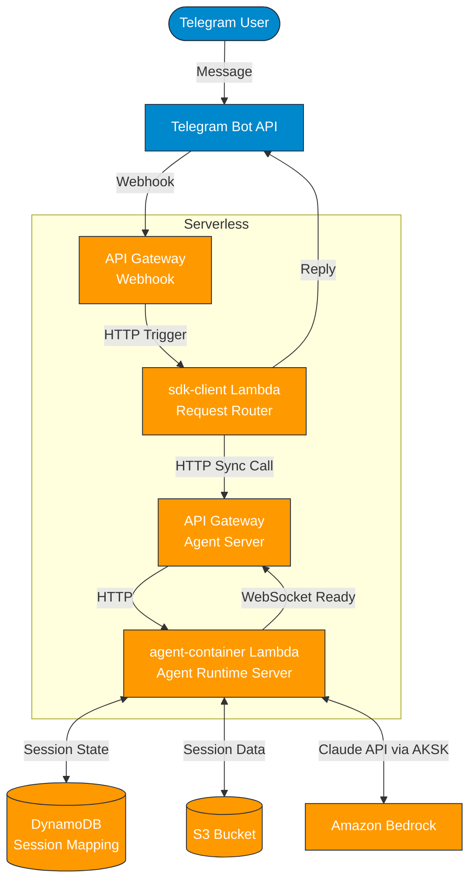

# AWS Lambda + S3 部署方案

基于 Claude Agent SDK 官方文档推荐的 **Pattern 3: Hybrid Sessions** 模式，采用二层架构：
- **sdk-client Lambda**：Telegram Webhook 接收器 + 请求路由层
- **agent-container Lambda**：Agent Runtime Server + Session 管理层

## 1. 架构概览



## 2. 为什么选择 Lambda + S3

| 特性 | 说明 |
|------|------|
| **低成本** | 按请求计费，空闲时 $0 |
| **自动热保持** | 5-15 分钟内请求无冷启动 |
| **自动扩展** | 并发自动扩展到 1000+ |
| **简单运维** | 无需管理服务器/容器编排 |
| **默认公网访问** | 无需 VPC，可直接调用 Bedrock API |

## 3. Session 持久化架构

### ~/.claude/ 目录结构（实测验证）

```
~/.claude/
├── projects/                    # 按项目路径分组
│   └── {project-path}/
│       └── {session_id}.jsonl   # ⭐ 对话历史（Resume 必需）
├── debug/
│   └── {session_id}.txt         # 调试日志
├── todos/
│   └── {session_id}-agent-{session_id}.json  # Todo 状态
├── settings.json                # 用户设置（镜像内置）
├── agents/                      # Subagents（镜像内置）
├── skills/                      # Skills（镜像内置）
└── plugins/                     # 插件（镜像内置）
```

**关键区分**：
- **Session 相关**（需要 S3 同步）：`projects/`、`debug/`、`todos/` 下的 session 文件
- **配置相关**（镜像内置）：`settings.json`、`agents/`、`skills/`、`plugins/`

### Session 文件（实测验证）

| 文件 | 本地路径 | 用途 |
|------|----------|------|
| **对话历史** | `~/.claude/projects/{project-path}/{session_id}.jsonl` | Resume 必需 |
| **调试日志** | `~/.claude/debug/{session_id}.txt` | 调试追踪 |
| **Todo 状态** | `~/.claude/todos/{session_id}-agent-{session_id}.json` | 任务列表 |

### S3 存储结构

```
s3://omnicloud-agent-sessions/
└── sessions/
    └── {session_id}/
        ├── conversation.jsonl    # 对话历史
        ├── debug.txt             # 调试日志
        └── todos.json            # Todo 状态
```

### Lambda + S3 同步方案

```
┌─────────────────────────────────────────────────────────────┐
│                    Lambda Container                          │
│                                                              │
│  镜像内置：~/.claude/settings.json, agents/, skills/         │
│                                                              │
│  运行时同步（S3 ↔ 本地）：                                   │
│  - projects/{project-path}/{session_id}.jsonl               │
│  - debug/{session_id}.txt                                   │
│  - todos/{session_id}-agent-{session_id}.json               │
│                                                              │
└─────────────────────────────────────────────────────────────┘
                              ↕
┌───────────────────────┐      ┌───────────────────────┐
│   S3 Bucket           │      │   DynamoDB            │
│   sessions/           │      │   session-mapping     │
│                       │      │                       │
│   存储：              │      │   存储：              │
│   - 3 个 session 文件 │      │   - chat_id:thread_id │
│   - 按 session_id 分组│      │     → session_id      │
└───────────────────────┘      └───────────────────────┘
```

## 4. 组件清单

| 组件 | 用途 | 配置要点 |
|------|------|---------|
| **sdk-client Lambda** | Telegram Webhook 接收 + 请求路由 | 内存 512-1024MB, 超时 15 分钟, ZIP 部署 |
| **agent-container Lambda** | Agent Runtime Server + Session 管理 | 内存 2GB+, 超时 15 分钟, 容器部署 |
| **API Gateway (Webhook)** | Telegram Webhook 入口 | HTTP API (低延迟), 与 sdk-client 关联 |
| **API Gateway (Agent)** | Agent 服务端点 | HTTP/REST API, 与 agent-container 关联, 支持 WebSocket 扩展 |
| **S3** | Session 数据存储 | 生命周期策略, 加密 |
| **DynamoDB** | Session ID 映射 + 并发锁 | 按需计费, TTL |
| **ECR** | 容器镜像仓库（仅 agent-container） | - |
| **Secrets Manager** | 凭证存储 | Bedrock AKSK, TELEGRAM_BOT_TOKEN |

## 5. 请求流程

### 新会话（首次消息）

```
=== sdk-client Lambda（Telegram Webhook 接收器）===
1. Telegram Webhook → API Gateway → sdk-client Lambda
2. sdk-client 解析 chat_id, message_thread_id, text
3. sdk-client 查询 DynamoDB，session_id 不存在
4. sdk-client 立即返回 200 OK 给 Telegram（异步处理）

=== 异步处理部分 ===
5. sdk-client HTTP 同步调用 agent-container：
   POST /session/create
   Body: { chat_id, thread_id, user_message }

=== agent-container Lambda（Agent Server）===
6. agent-container 创建新 Agent 会话
7. Agent 返回新的 session_id
8. agent-container 保存 chat_id:thread_id → session_id 到 DynamoDB
9. agent-container 初始化 3 个 session 文件到 S3：
   - sessions/{session_id}/conversation.jsonl
   - sessions/{session_id}/debug.txt
   - sessions/{session_id}/todos.json
10. agent-container 返回 response + session_id 给 sdk-client

=== sdk-client Lambda（回复阶段）===
11. sdk-client 调用 Telegram Bot API 发送回复
```

### 已有会话（后续消息）

```
=== sdk-client Lambda（Telegram Webhook 接收器）===
1. Telegram Webhook → API Gateway → sdk-client Lambda
2. sdk-client 解析 chat_id, message_thread_id, text
3. sdk-client 查询 DynamoDB，获取 session_id（缓存或直接查询）
4. sdk-client 立即返回 200 OK 给 Telegram

=== 异步处理部分 ===
5. sdk-client HTTP 同步调用 agent-container：
   POST /session/{session_id}/message
   Body: { user_message, metadata }

=== agent-container Lambda（Agent Server）===
6. agent-container 从 S3 下载 3 个 session 文件：
   - sessions/{session_id}/conversation.jsonl → ~/.claude/projects/{project-path}/{session_id}.jsonl
   - sessions/{session_id}/debug.txt → ~/.claude/debug/{session_id}.txt
   - sessions/{session_id}/todos.json → ~/.claude/todos/{session_id}-agent-{session_id}.json
7. agent-container 调用 Agent，传入 session_id（resume）
8. Agent 调用 Bedrock 处理消息
9. Agent 返回响应
10. agent-container 将 3 个 session 文件上传回 S3
11. agent-container 返回 response 给 sdk-client

=== sdk-client Lambda（回复阶段）===
12. sdk-client 调用 Telegram Bot API 发送回复
```

## 6. 关键配置

### 环境变量

#### sdk-client Lambda

| 变量 | 说明 |
|------|------|
| `TELEGRAM_BOT_TOKEN` | 从 Secrets Manager 注入 |
| `SESSION_TABLE` | DynamoDB 表名 |
| `AGENT_SERVER_URL` | agent-container Lambda 的 API Gateway 端点（HTTP） |
| `AGENT_SERVER_AUTH_TOKEN` | 可选，用于 server-to-server 认证 |

#### agent-container Lambda

| 变量 | 说明 |
|------|------|
| `CLAUDE_CODE_USE_BEDROCK` | 设为 `1` 启用 Bedrock |
| `AWS_ACCESS_KEY_ID` | Bedrock 账号的 Access Key（从 Secrets Manager 注入） |
| `AWS_SECRET_ACCESS_KEY` | Bedrock 账号的 Secret Key（从 Secrets Manager 注入） |
| `AWS_REGION` | Bedrock 所在区域（如 `us-east-1`） |
| `ANTHROPIC_DEFAULT_OPUS_MODEL` | Bedrock Opus 模型 ID（如 `anthropic.claude-opus-4-20250514-v1:0`） |
| `ANTHROPIC_DEFAULT_SONNET_MODEL` | Bedrock Sonnet 模型 ID（如 `anthropic.claude-sonnet-4-20250514-v1:0`） |
| `ANTHROPIC_DEFAULT_HAIKU_MODEL` | Bedrock Haiku 模型 ID（如 `anthropic.claude-haiku-4-20250514-v1:0`） |
| `SESSION_BUCKET` | S3 存储桶名称 |
| `SESSION_TABLE` | DynamoDB 表名 |
| `SDK_CLIENT_AUTH_TOKEN` | 可选，用于验证来自 sdk-client 的请求 |

**注意**：
- Bedrock 账号与 Lambda 运行账号不同，需要配置 Bedrock 账号的 AKSK 用于 Claude API 调用
- agent-container 的 IAM Role 用于访问 S3、DynamoDB 等本账号资源
- sdk-client 通过环境变量或 Secrets Manager 获得 agent-container 的 URL，实现解耦

### Lambda 配置

#### sdk-client Lambda

| 配置项 | 推荐值 | 说明 |
|--------|-------|------|
| 内存 | 512-1024 MB | 仅需 Telegram 解析和请求路由 |
| 超时 | 900 秒 (15 分钟) | HTTP 同步调用 agent-container 等待时间 |
| 临时存储 | 512 MB | 无需存储 session 数据 |
| 架构 | arm64 | 轻量级应用，arm64 更便宜 |
| 预留并发 | 可选 | 消除冷启动，低成本 |
| 部署方式 | ZIP | Python + 依赖库 |

#### agent-container Lambda

| 配置项 | 推荐值 | 说明 |
|--------|-------|------|
| 内存 | 2048-4096 MB | Claude Code CLI 需要足够内存 |
| 超时 | 900 秒 (15 分钟) | Agent 对话处理时间 |
| 临时存储 | 1024 MB+ | ~/.claude/ session 数据 |
| 架构 | arm64 | arm64 更便宜 |
| 预留并发 | 可选 | 消除冷启动，生产建议配置 1-2 |
| 部署方式 | 容器镜像（ECR） | 包含 Claude Code CLI |

### S3 配置

| 配置项 | 推荐值 | 说明 |
|--------|-------|------|
| 存储类型 | S3 Standard | 频繁访问 |
| 生命周期策略 | 30 天后转 IA，90 天后删除 | 成本优化 |
| 加密 | SSE-S3 或 SSE-KMS | 安全要求 |
| 版本控制 | 可选 | 防止误删 |

### DynamoDB 配置

| 配置项 | 推荐值 | 说明 |
|--------|-------|------|
| 主键 | session_key (String) | chat_id:thread_id |
| 计费模式 | 按需 | 低流量更省 |
| TTL | 25 天 | 略短于 S3 生命周期 |

## 7. 部署步骤

### 基础设施

1. **创建 S3 存储桶**
   - 启用加密
   - 配置生命周期策略

2. **创建 DynamoDB 表**
   - 主键: session_key (String)
   - 启用 TTL

3. **创建 Secrets Manager**
   - Bedrock 账号 AWS_ACCESS_KEY_ID
   - Bedrock 账号 AWS_SECRET_ACCESS_KEY
   - TELEGRAM_BOT_TOKEN

### agent-container Lambda 部署

4. **创建 ECR 仓库 + 推送镜像**
   - 基础镜像：Python 3.11+
   - 安装：Claude Code CLI、Python SDK
   - 打包：entrypoint 为 HTTP Server（处理 /session/create、/session/{id}/message）

5. **创建 agent-container Lambda 函数**
   - 镜像来源：ECR
   - 配置内存、超时、临时存储（见上文）
   - 配置环境变量（CLAUDE_CODE_USE_BEDROCK、Bedrock AKSK、SESSION_BUCKET、SESSION_TABLE）
   - 配置 IAM Role：
     - S3 读写权限（SESSION_BUCKET）
     - DynamoDB 读写权限（SESSION_TABLE）
     - Secrets Manager 读权限（可选，若使用密钥存储）
     - 注：Bedrock 通过 AKSK 认证，不需要 Lambda Role 权限

6. **创建 API Gateway (Agent Server)**
   - 类型：HTTP API 或 REST API
   - 集成：agent-container Lambda
   - 创建路由：
     - POST /session/create
     - POST /session/{session_id}/message
   - 启用 CORS（用于后续 WebSocket 扩展）
   - 获取 API Gateway URL（供 sdk-client 调用）

### sdk-client Lambda 部署

7. **创建 sdk-client Lambda 函数 (ZIP)**
   - 代码语言：Python
   - 依赖：requests、boto3
   - 功能：
     - Telegram Webhook 解析
     - DynamoDB session_key 查询/存储
     - HTTP 调用 agent-container
     - Telegram Bot API 回复
   - 配置内存、超时、临时存储（见上文）
   - 配置环境变量（TELEGRAM_BOT_TOKEN、SESSION_TABLE、AGENT_SERVER_URL）
   - 配置 IAM Role：
     - DynamoDB 读写权限（SESSION_TABLE）
     - Secrets Manager 读权限（可选）

8. **创建 API Gateway (Webhook)**
   - 类型：HTTP API
   - 集成：sdk-client Lambda
   - 创建路由：
     - POST /webhook
   - 获取 API Gateway URL（供 Telegram 配置）

9. **配置 Telegram Webhook**
   - 设置 Webhook URL 指向 API Gateway (Webhook) 的 POST /webhook 端点
   ```bash
   curl -X POST "https://api.telegram.org/bot{TELEGRAM_BOT_TOKEN}/setWebhook" \
     -H "Content-Type: application/json" \
     -d '{"url": "https://{API_GATEWAY_WEBHOOK_URL}/webhook", "secret_token": "..."}'
   ```

## 8. 成本估算

二层架构的成本分析：

| 组件 | 估算成本 | 备注 |
|------|---------|------|
| sdk-client Lambda（低流量） | ~$0（免费额度内） | 轻量级，内存 512MB，快速响应 |
| sdk-client Lambda（10万次/月） | ~$2-3 | 仅路由，不消耗算力 |
| agent-container Lambda（低流量） | ~$0（免费额度内） | 内存 2GB+，需要更多算力 |
| agent-container Lambda（10万次/月） | ~$20 | 主要消耗来源 |
| API Gateway（2 个） | ~$2 | Webhook 端点 + Agent Server 端点 |
| S3 | ~$0.023/GB/月 | Session 数据存储 |
| DynamoDB | ~$0（按需，低流量） | 简单查询 |
| Bedrock Claude | 按 token 计费 | 主要成本 |

**总成本（低流量）**：几乎为 $0（主要是 Bedrock token 费用）
**总成本（中流量，10万次/月）**：~$25-30（不含 Bedrock token）

## 9. 冷启动优化

二层架构的冷启动特性：

| 组件 | 冷启动时间 | 优化建议 |
|------|-----------|---------|
| sdk-client | ~0.5-1s（Python ZIP） | 低成本，可接受 |
| agent-container | 1-3s（容器） | 可配置预留并发消除 |
| 端到端延迟 | ~2-5s | 大部分时间用于 HTTP 调用 |

**建议**：
- 开发环境：无需优化，接受冷启动
- 测试环境：sdk-client 预留 1 并发（低成本）
- 生产环境：agent-container 预留 1-2 并发（~$15-30/月），sdk-client 可选

## 10. 二层架构的优势与注意事项

### 优势

1. **职责清晰**：sdk-client 只负责 Telegram 交互，agent-container 专注 Agent 运行
2. **独立扩展**：可独立扩展各层，如后续添加多个 client
3. **解耦灵活**：未来可无缝升级为 WebSocket 或其他协议
4. **成本优化**：sdk-client 使用轻量级配置，降低基础成本

### 注意事项

1. **Lambda 超时**：单次对话不能超过 15 分钟，超长对话需要分段处理
2. **HTTP 调用延迟**：sdk-client → agent-container 的 HTTP 同步调用增加 50-500ms 延迟（取决于网络）
3. **并发安全**：同一 session 并发请求需要加锁（DynamoDB 条件写入或 agent-container 内部锁）
4. **Telegram 超时**：Lambda 快速返回 200 OK 给 Telegram，Agent 处理异步完成
5. **Session 生命周期同步**：
   - DynamoDB TTL 设为 25 天，S3 生命周期 30 天
   - DynamoDB 映射先过期，避免引用不存在的 session
   - 应用层需处理 resume 失败：S3 文件不存在时创建新会话
6. **服务间认证**：建议配置 SDK_CLIENT_AUTH_TOKEN 在 agent-container，验证请求来源
7. **错误处理**：sdk-client 需要处理 agent-container 超时/失败，重试机制可选

## 11. 与其他方案对比

| 维度 | Lambda + S3 | Fargate + EFS | App Runner + EFS |
|------|-------------|---------------|------------------|
| 冷启动 | 1-3s | 无 | 3-5s |
| 最低成本 | ~$0 | ~$15/月 | ~$50/月 |
| 执行时间限制 | 15 分钟 | 无 | 无 |
| 运维复杂度 | 低 | 中 | 中 |
| Session 存储改造 | 需要 | 无需 | 无需 |
| 适用场景 | 低流量/MVP | 生产环境 | 不推荐 |
